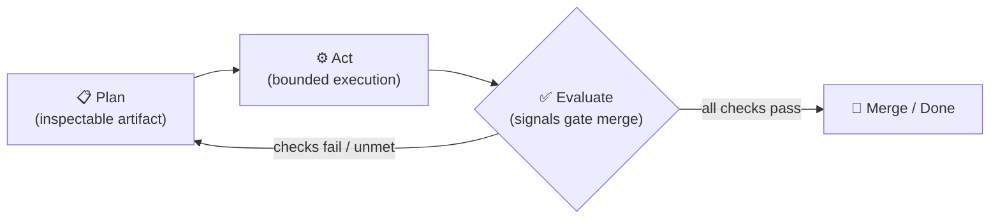
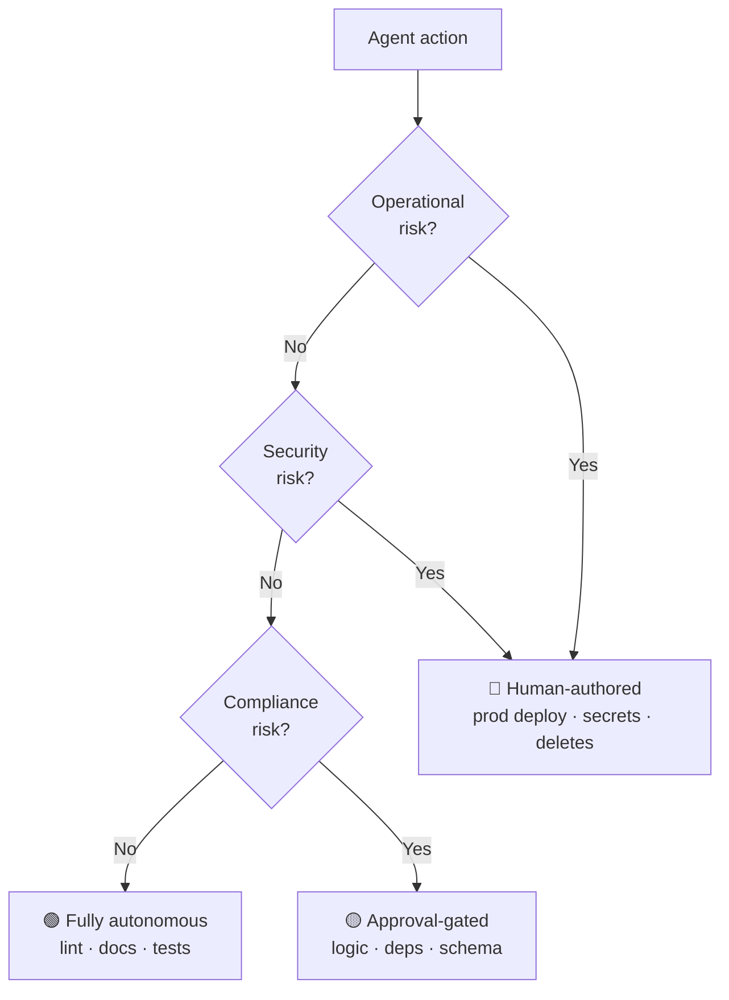
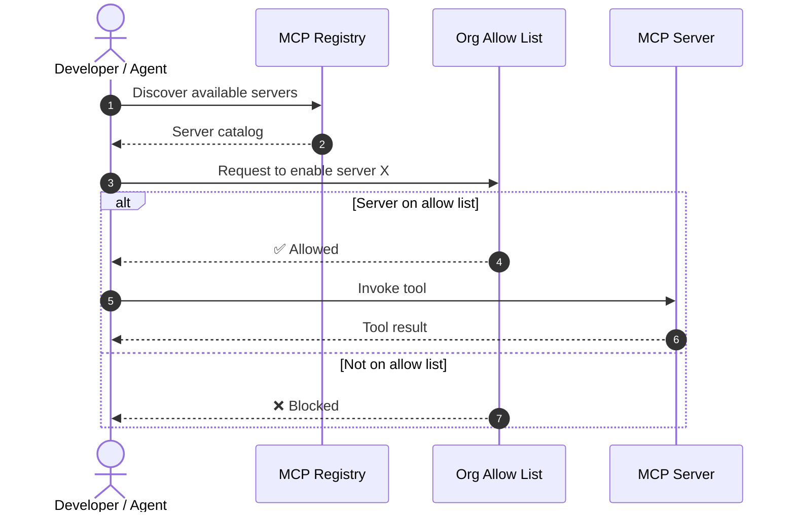
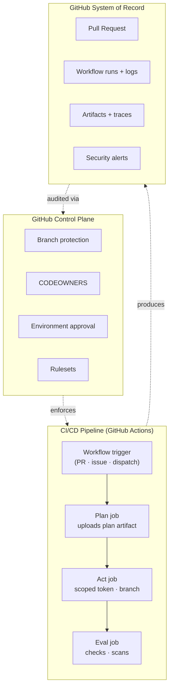
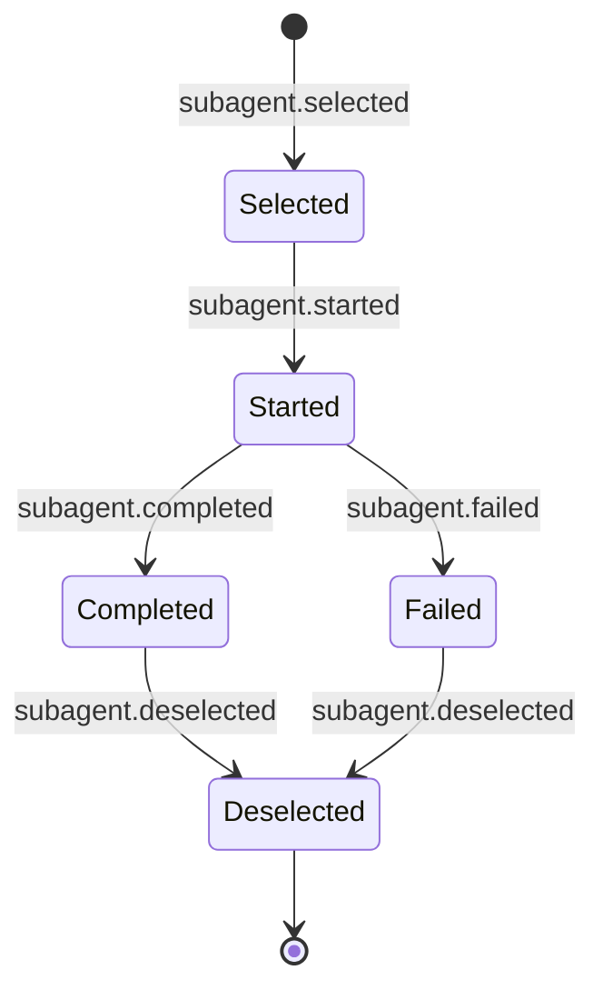

# GH-600 Diagrams (Mermaid source)

Centralized source for the 5 study diagrams. Each block is also inlined into the relevant module/research markdown so it renders in NotebookLM, GitHub, and Notion automatically — but maintain them here first.

---

## 1. Plan → Act → Evaluate lifecycle

**Embedded in**: `modules/01-foundations/03-agent-lifecycle.md`
**Exam domain**: 1 (Architecture & SDLC processes)

The loop is the key: evaluate failures don't terminate the agent — they feed back into a new plan. Linear flow is the anti-pattern.

---

## 2. Risk-tiered autonomy decision tree

**Embedded in**: `research/01-gap-docs/build-guardrails.md`
**Exam domain**: 6 (Guardrails & accountability)

Any-yes-routes-up: if *any* risk dimension trips, escalate. The exam will test this triage order.

---

## 3. MCP server / registry / allow list interaction

**Embedded in**: `modules/03-tooling-mcp/03-mcp-servers-registries-allowlists.md`
**Exam domain**: 2 (Tool use & environment interaction — highest weighted)

The allow list is enforced *after* registry discovery, *before* the tool call. Skipping the allow-list check is the most common exam-trap scenario.

---

## 4. SDLC integration: control plane + system of record

**Embedded in**: `modules/02-architecture/05-pr-governance.md`
**Exam domain**: 1 (Architecture & SDLC) + 6 (Guardrails)

Same GitHub primitives both *record* activity and *enforce* policy — that's what "system of record AND control plane" means in the audience profile.

---

## 5. Sub-agent lifecycle (Copilot SDK state machine)

**Embedded in**: `research/01-gap-docs/custom-agents-sdk.md`
**Exam domain**: 5 (Multi-agent orchestration)

Five events, three terminal-ish states. `toolCallId` is the join key across all events for a given sub-agent invocation.

---

## How to update

1. Edit the Mermaid block here first.
2. Search the target file for the existing block (each embedded copy has a `<!-- diagrams.md:N -->` marker).
3. Replace with the new version.

If you add a new diagram, append it here, then embed with the same marker convention.
